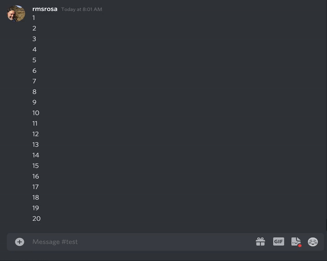

# HoJBot

This is the Discord bot for Humans of Julia community server.

**All HoJ members are invited to contribute to this project.**
Please read  to get started.

## Features

1. The _happy reactor_: automatically reacts to your message with a smiley when your message sounds happy. Similarly, there are also _excited_ and _disappointed_ reactors.

2. The time zone command (`tz`): easily converts a date/time into multiple predefined timezones. This is perfect for setting up meeting time that works for our global community.
Quick demo:

3. The julia command (`j`): currently, only `j?<name>` or, alternatively, `j doc <name>` is implemented, returning the docstring for `<name>`.
Quick demo:

